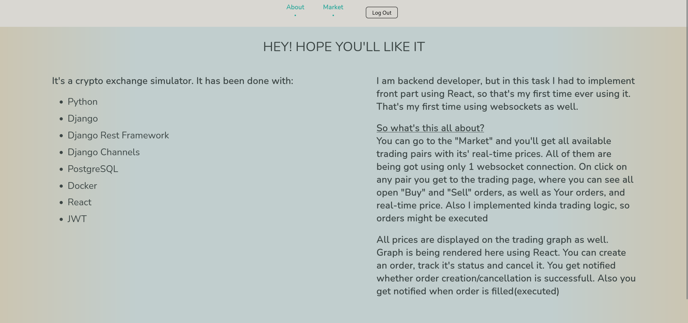
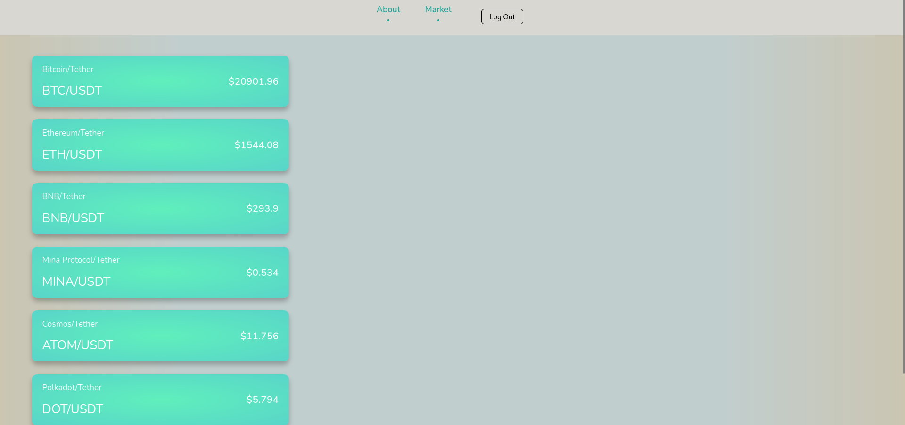
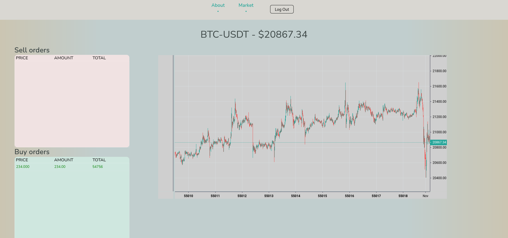
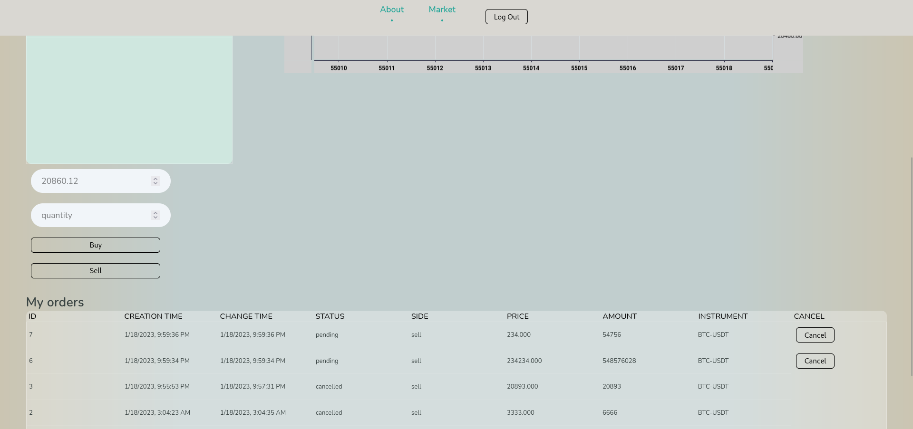

### Description

This is trading exchange platform that allows both http and websocket multiple connections for getting real-time data.
You can
create orders for the purchase or sale of any asset represented on the exchange. The exchange gets those orders and,
using trading logic, looking for a counter order and fills the order. Interaction with the exchange occurs through a
trading terminal, which is a client in this architecture, and the exchange itself is a server.

You can go to the "Market" and you'll get all available trading
pairs with its' real-time prices. All of them are being got using only 1
websocket connection. On click on any pair you get to the trading page, where you
can see all open "Buy" and "Sell" orders, as well as Your orders,
and real-time price. Also I implemented kinda trading logic, so orders might be
executed

All prices are displayed on the trading graph as well. Graph is being rendered
here using React. You can create an order, track it's status and cancel it.
You get notified whether order creation/cancellation is successfull. Also you get
notified when order is filled(executed)

### Starting the project

1. Clone it
   `git clone https://github.com/mrnosomebody/exchange.git`
2. Create .env file in the project root `touch .env` containing this variables:

```
SECRET_KEY=<your_secret_here>
DB_NAME=<your_db_name_here>
DB_USER=<your_db_user_here>
DB_PASSWORD=<your_db_password_here>
DB_HOST=db
DB_PORT=5432
ACCESS_TOKEN_LIFETIME=<token_lifetime>
```

3. Start docker container
   ` sudo docker-compose up --build`

4. That's it. Go to the `localhost:3000/`. Database already contains some data, because I prepopulated it in custom
   migration

### Features

- Trading logic
- All orders are stored in PostgreSQL
- Quotes are displayed on the trading graph
- Notifications when order status changes
- Multiple tickers(pairs of assets)
- Orders table sorting
- JWT Authentication
- Cancellation of pending orders

## UI




